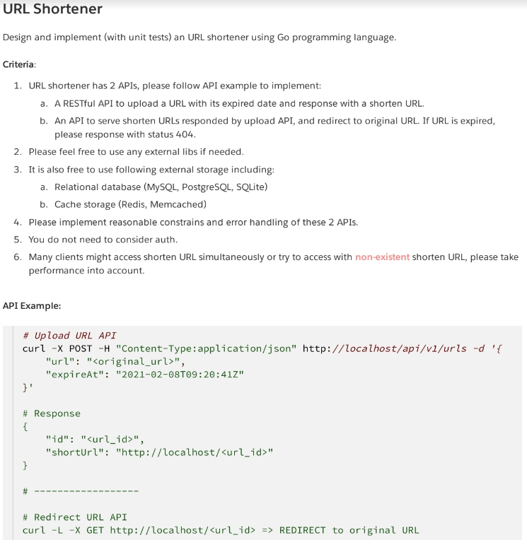
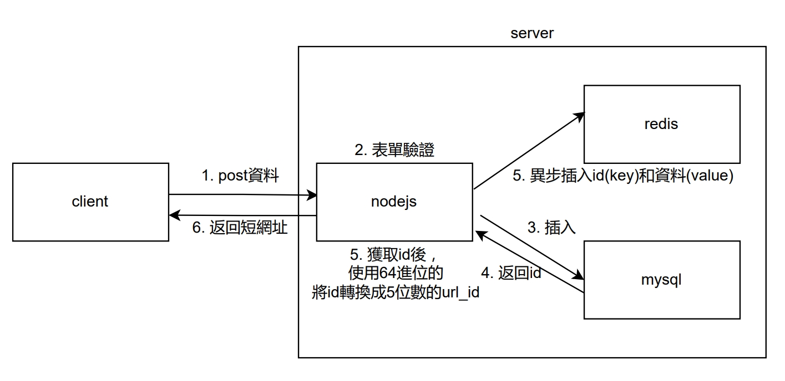
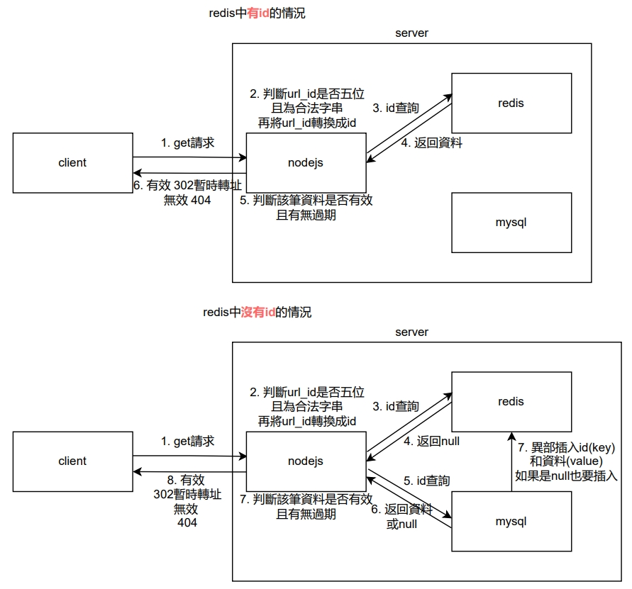

# URL Shortener(2022 Dcard backend實習生題目)

## 一、如何使用

> 第一次使用，請安裝npm的lib，並請確認機器是否有安裝node、npm

```gherkin=
npm i
```

### 1. 使用docker-compose

* 開啟docker中的mysql、redis
```gherkin=
docker-compose up -d
```

* 確認mysql、redis開啟後，開啟服務
```gherkin=
npm run dev
```
###  2. 不使用docker-compose

#### mysql、redis配置

* 建立mysql資料庫和資料表
> 資料庫名稱：shortURL<br>
> 資料表名稱：url

`init.sql`
```gherkin=
CREATE DATABASE IF NOT EXISTS shortURL;
USE shortURL;
CREATE TABLE IF NOT EXISTS `shortURL`.`url` ( `id` INT UNSIGNED NOT NULL AUTO_INCREMENT , `url` TEXT NOT NULL , `expireAt` INT NOT NULL , PRIMARY KEY (`id`)) ENGINE = InnoDB
```
* 再配置連線的config

`src/config/db.js`
```gherkin=
MYSQL_CONF = {
    host: 'localhost',
    user: '<username>',
    password: '<password>',
    port: '3306',
    database: 'shortURL'
};
REDIS_CONF = {
    port: 6379,
    host: '127.0.0.1'
};
```
* 確認mysql、redis配置好且開啟後，開啟服務
```gherkin=
npm run dev
```

## 二、題目



## 三、解題思路

### 1. 題目解釋

* 使用 Golang 或 Nodejs 其中一個語言建立兩個Restful API(包含Unit Test)
	
	1. 可以上傳一個URL網址和過期時間，並且返回一個被縮短好的URL
	
	2. 判斷系統生成的短網址是否存在且有無到期，如果到期和不存在，則返回404；反之，為原本URL進行轉址

* 可以使用任意三方函式庫和資料庫或Cache資料庫

* 替兩個API進行錯誤處理

* 不用Auth

* 要考慮到客戶端同時大量請求短網址(包括不存在的短網址)的問題，將性能納入考量

### 2. 程式邏輯

#### API 1 => GET /:ShortId([a-zA-Z0-9-~]{5})

* 程式流程



* 方法
	1. ~~短網址的 url_id 必須是一個唯一值，如果說使用md5取前幾位數的話，那麼很容易產生碰撞，所以不適合。~~
	
	2. 使用64進位的方式，將url和expireAt插入mysql中返回的自增id(唯一且以主鍵搜尋很快)作轉換

`src/controller/index.js`
```gherkin=
const { get, set } = require('../db/redis');
const { ErrorModel, BaseModel } = require('../utils/response');
const { HOST_CONF } = require('../config/url');
const { getURL, insertURL} = require('../model/index');
const { validateUrl, validateExpire, convertIdToShortId } = require("../utils/url");

const insertOriginUrl = async (url, expireAt) => {
	//表單驗證，判斷url和datetime是否valid
    if(url === "" || !validateUrl(url)) {
        return new ErrorModel(`The post data url = ${url} is invalid!!!`);
    } else if(isNaN(Date.parse(expireAt)) || Date.parse(expireAt) < 1000000000) {
        return new ErrorModel(`The post data expireAt = ${expireAt} is invalid!!!`);
    }

	//js中timestamp是毫秒級的，所以必須除以1000
    expireAt = new Date(expireAt).getTime() / 1000;

	//插入mysql
    const data = await insertURL(url, expireAt)

    // 插入redis
    set(data['id'], { url: url, expireAt: expireAt })

    // 得到新增的id後
    const ShortId = convertIdToShortId(data['id'])

    // 返回短網址
    return new BaseModel(ShortId, HOST_CONF + ShortId);
};

```

* 轉換url_id位數
	
	* 目前使用5位數字串(64 ^ 5 = 1,073,741,824)，原因是我使用unsigned int (4,294,967,295)，為了避免int不夠用
	
	* 如果之後想要改更長，可以使用unsigned bigint(2 ^ 64 - 1)，就可以讓字串數增加至多到10位數字串(64 ^ 10)

`src/utils/url.js`
```gherkin=
const { _64Bit, urlMaxLength } = require('./const');

//目前使用5位字串(64 ^ 5 = 1,073,741,824)，原因是我使用unsigned int (4,294,967,295)
//如果之後想要改更長，可以使用unsigned bigint(2 ^ 64 - 1)，就可以讓字串數增加至多到10位字串(64 ^ 10)

//將id轉換成64進位的5位字串
const convertIdToShortId = (id) => {
    let ShortId = "";
    
    //將id值轉換成64位元的字符
    while(id !== 0) {
        let tmp = "";

        tmp = ShortId;
        ShortId = _64Bit[id%64] + tmp;
        id = Math.floor(id/64);
    }

    //小於5位，就補滿5位
    while(ShortId.length !== urlMaxLength) {
        ShortId = _64Bit[0] + ShortId;
    }

    return ShortId;
}

//將64進位的5位字串轉換成id
const convertShortIdToId = (ShortId) => {
    let i = 0;
    let id = 0;
    //將字串分割成array
    const ShortIdArray = ShortId.split("");
    
    //轉換成原本id
	//ex key * 64 ^ 0 + key * 64 ^ 1 + key * 64 ^ 2 + key * 64 ^ 3 + key(0-63) * 64 ^ 4 (key是五位字串中，分別對應64進位table的index)
    while(i < urlMaxLength) {
        id += (_64Bit.findIndex(char => char === ShortIdArray[urlMaxLength - (i + 1)])) * Math.pow(64, i);
        i++;
    }

    return id;
}
```

* 64進位
	* 我將 A-Z, a-z, 0-9, -, ~ 這些字元打亂順序之後，放入一個陣列當作進位表

`src/utils/const.js`
```gherkin=
const urlMaxLength = 5;
const _64Bit = new Array("N", "O", "P", "4", "5", "6", "7", "8", "9", "m", "Q", "R", "S", "X", "Y", "A", "B", "C", "K", "L", "M", "D", "E", "T", "U", "V", "W", "F", "a", "b", "c", "d", "e", "f", "r", "s", "t", "u", "v", "w", "G", "H", "I", "J", "1", "2", "3", "-", "~", "Z", "g", "h", "i", "j", "k", "l", "n", "o", "p", "q", "x", "y", "z", "0",);
```

#### API 2 => POST /api/v1/urls

* 程式流程




* 方法

	* 由於後端性能的問題主要出在 網路頻寬速度 和 Disk I/O，在程式碼中就必須為資料庫方面減少負荷，多多採用記憶體作為一個快速的解決方案

	* 所以我會先讓nodejs先去從redis(記憶體資料庫)中查找id是否存在

	* 有則，判斷資料是否有效且有無過期，然後返回404或302

		* 使用302(暫時轉址)原因是因為短網址是有期限的，所以每次轉址都必須讓server判斷資料是否有效，雖然301(永久轉址)性能較好，但是他會被cache在瀏覽器，導致無法到server判斷資料

	* 無則，向mysql(I/O資料庫)查找id是否存在

	* 若有該筆id，使用異步的方式儲存到redis並判斷資料是否有效且有無過期，然後返回404或302

	* 若無該筆id，異步新增一個{ url: null, expireAt: Date.now() / 1000 }資料到redis，返回404
		* 因為題目中有提到如果該筆資料不存在那一直查找不存在的資料也是浪費性能，不如就儲存一個無效值在redis，直接返回404


`src/controller/index.js`
```gherkin=
const { get, set } = require('../db/redis');
const { ErrorModel, BaseModel } = require('../utils/response');
const { HOST_CONF } = require('../config/url');
const { getURL, insertURL} = require('../model/index');
const { validateUrl, validateExpire, convertIdToShortId } = require("../utils/url");
const getOriginUrlById = async (id, req, res) => {
    let result = await get(id)
    if(result === null) {
        // redis沒有，往mysql找
        result = await getURL(id)
        // 有沒有找到都要存入redis，目的是避免同時大量查找不存在的url
        if(result.length !== 0) {
            set(id, { url: result[0]['url'], expireAt: result[0]['expireAt'] })
        } else {
            set(id, { url: null, expireAt: Date.now() / 1000 })
        }

    }

    //redis有，直接從redis返回
    if(result['url'] !== undefined && validateExpire(result['expireAt'])) {
        //如果這筆短網址存在，使用302避免301 expire了照樣會有cache
        res.writeHead(302, { 'Location': result['url'] });
    } else {
        res.writeHead(404, {"Content-type": "text/plain"});
		res.write(`${req.method} ${req.path} 404 Not Found\n`);
    }
    res.end();
    return;
};
```

## 三、性能比較(使用ab)

### 1. 對比有使用redis和沒使用redis的性能

* 同時一百個請求，總共訪問一萬次有效短網址

`有redis`
```gherkin=
C:\Users\poabob\Desktop> .\ab.exe -n 10000 -c 100 http://localhost/NNNNB

Concurrency Level:      100
Time taken for tests:   5.225 seconds
Complete requests:      10000
Failed requests:        0
Non-2xx responses:      10000
Total transferred:      2000000 bytes
HTML transferred:       0 bytes
Requests per second:    1913.98 [#/sec] (mean)
Time per request:       52.247 [ms] (mean)
Time per request:       0.522 [ms] (mean, across all concurrent requests)
Transfer rate:          373.83 [Kbytes/sec] received

Connection Times (ms)
              min  mean[+/-sd] median   max
Connect:        0    0   0.4      0       1
Processing:    20   52  10.1     52      83
Waiting:        8   41   6.8     41      66
Total:         21   52  10.1     52      83

Percentage of the requests served within a certain time (ms)
  50%     52
  66%     56
  75%     59
  80%     61
  90%     65
  95%     68
  98%     74
  99%     76
 100%     83 (longest request)
```

`無redis，只有mysql`
```gherkin=
C:\Users\poabob\Desktop> .\ab.exe -n 10000 -c 100 http://localhost/NNNNB

Concurrency Level:      100
Time taken for tests:   8.549 seconds
Complete requests:      10000
Failed requests:        0
Non-2xx responses:      10000
Total transferred:      2000000 bytes
HTML transferred:       0 bytes
Requests per second:    1169.68 [#/sec] (mean)
Time per request:       85.493 [ms] (mean)
Time per request:       0.855 [ms] (mean, across all concurrent requests)
Transfer rate:          228.45 [Kbytes/sec] received

Connection Times (ms)
              min  mean[+/-sd] median   max
Connect:        0    0   0.4      0       1
Processing:    21   85   5.0     84     102
Waiting:        9   85   5.0     84     102
Total:         22   85   5.0     84     102

Percentage of the requests served within a certain time (ms)
  50%     84
  66%     86
  75%     87
  80%     88
  90%     90
  95%     93
  98%     96
  99%     97
 100%    102 (longest request)
```

* 同時一千個請求，總共訪問十萬次有效短網址

`有redis`
```gherkin=
C:\Users\poabob\Desktop> .\ab.exe -n 100000 -c 1000 http://localhost/NNNNB

Concurrency Level:      1000
Time taken for tests:   67.488 seconds
Complete requests:      100000
Failed requests:        0
Non-2xx responses:      100000
Total transferred:      20000000 bytes
HTML transferred:       0 bytes
Requests per second:    1481.74 [#/sec] (mean)
Time per request:       674.883 [ms] (mean)
Time per request:       0.675 [ms] (mean, across all concurrent requests)
Transfer rate:          289.40 [Kbytes/sec] received

Connection Times (ms)
              min  mean[+/-sd] median   max
Connect:        0    1  11.4      0     516
Processing:   114  668 261.7    437    1447
Waiting:        7  497 270.5    381    1308
Total:        115  669 261.8    438    1448

Percentage of the requests served within a certain time (ms)
  50%    438
  66%    922
  75%    927
  80%    930
  90%    936
  95%    940
  98%    952
  99%    962
 100%   1448 (longest request)
```

`無redis，只有mysql`
```gherkin=
C:\Users\poabob\Desktop> .\ab.exe -n 100000 -c 1000 http://localhost/NNNNB

Concurrency Level:      1000
Time taken for tests:   88.510 seconds
Complete requests:      100000
Failed requests:        0
Non-2xx responses:      100000
Total transferred:      20000000 bytes
HTML transferred:       0 bytes
Requests per second:    1129.81 [#/sec] (mean)
Time per request:       885.103 [ms] (mean)
Time per request:       0.885 [ms] (mean, across all concurrent requests)
Transfer rate:          220.67 [Kbytes/sec] received

Connection Times (ms)
              min  mean[+/-sd] median   max
Connect:        0    0   0.4      0       6
Processing:   225  880  42.1    878    1028
Waiting:        3  879  42.2    877    1027
Total:        225  880  42.1    878    1028

Percentage of the requests served within a certain time (ms)
  50%    878
  66%    882
  75%    885
  80%    887
  90%    896
  95%    923
  98%    970
  99%   1000
 100%   1028 (longest request)
```

### 2. 還可不可以優化性能?

* 因為nodejs是單個porcess的設計，我們可以使用pm2來實現多個nodejs process 提高效率

* 安裝

```gherkin=
npm i pm2 --save-dev
```

* 新增一些pm2的常用指令

`package.json`
```gherkin=
"scripts": {
    "test": "echo \"Error: no test specified\" && exit 1",
    "dev": "cross-env NODE_ENV=dev nodemon ./bin/www.js",
    "prd": "cross-env NODE_ENV=dev pm2 start ./bin/www.js -i 4",
    "restart": "cross-env NODE_ENV=dev pm2 restart www",
    "list": "cross-env NODE_ENV=dev pm2 list",
    "stop": "cross-env NODE_ENV=dev pm2 stop www",
    "delete": "cross-env NODE_ENV=dev pm2 delete www"
  },
```

* 開啟服務

```gherkin=
C:\Users\poabob\Desktop\Dcard> npm run prd

> nodejs@1.0.0 prd C:\Users\poabob\Desktop\Dcard
> cross-env NODE_ENV=dev pm2 start ./bin/www.js -i 4

[PM2] Starting C:\Users\poabob\Desktop\Dcard\bin\www.js in cluster_mode (4 instances)
[PM2] Done.
┌─────┬────────┬─────────────┬─────────┬─────────┬──────────┬────────┬──────┬───────────┬──────────┬──────────┬──────────┬──────────┐
│ id  │ name   │ namespace   │ version │ mode    │ pid      │ uptime │ ↺    │ status    │ cpu      │ mem      │ user     │ watching │
├─────┼────────┼─────────────┼─────────┼─────────┼──────────┼────────┼──────┼───────────┼──────────┼──────────┼──────────┼──────────┤
│ 0   │ www    │ default     │ 1.0.0   │ cluster │ 12848    │ 0s     │ 0    │ online    │ 0%       │ 49.8mb   │ poabob   │ disabled │
│ 1   │ www    │ default     │ 1.0.0   │ cluster │ 18548    │ 0s     │ 0    │ online    │ 0%       │ 49.5mb   │ poabob   │ disabled │
│ 2   │ www    │ default     │ 1.0.0   │ cluster │ 5168     │ 0s     │ 0    │ online    │ 0%       │ 49.8mb   │ poabob   │ disabled │
│ 3   │ www    │ default     │ 1.0.0   │ cluster │ 23444    │ 0s     │ 0    │ online    │ 0%       │ 49.6mb   │ poabob   │ disab
```

* 同時一百個請求，總共訪問一萬次有效短網址

```
C:\Users\poabob\Desktop> .\ab.exe -n 10000 -c 100 http://localhost/NNNNB

Concurrency Level:      100
Time taken for tests:   5.272 seconds
Complete requests:      10000
Failed requests:        0
Non-2xx responses:      10000
Total transferred:      2000000 bytes
HTML transferred:       0 bytes
Requests per second:    1896.64 [#/sec] (mean)
Time per request:       52.725 [ms] (mean)
Time per request:       0.527 [ms] (mean, across all concurrent requests)
Transfer rate:          370.44 [Kbytes/sec] received

Connection Times (ms)
              min  mean[+/-sd] median   max
Connect:        0    0   0.5      0       1
Processing:     6   52   4.0     52      87
Waiting:        6   39   8.6     40      70
Total:          6   52   4.0     53      87

Percentage of the requests served within a certain time (ms)
  50%     53
  66%     53
  75%     54
  80%     54
  90%     55
  95%     56
  98%     58
  99%     59
 100%     87 (longest request)
```


* 同時一千個請求，總共訪問十萬次有效短網址

```
C:\Users\poabob\Desktop> .\ab.exe -n 100000 -c 1000 http://localhost/NNNNB

Concurrency Level:      1000
Time taken for tests:   56.264 seconds
Complete requests:      100000
Failed requests:        0
Non-2xx responses:      100000
Total transferred:      20000000 bytes
HTML transferred:       0 bytes
Requests per second:    1777.33 [#/sec] (mean)
Time per request:       562.642 [ms] (mean)
Time per request:       0.563 [ms] (mean, across all concurrent requests)
Transfer rate:          347.13 [Kbytes/sec] received

Connection Times (ms)
              min  mean[+/-sd] median   max
Connect:        0    0   0.5      0       2
Processing:    68  560  38.2    556     687
Waiting:        3  299 159.2    299     679
Total:         68  560  38.2    557     687

Percentage of the requests served within a certain time (ms)
  50%    557
  66%    562
  75%    567
  80%    573
  90%    589
  95%    619
  98%    641
  99%    656
 100%    687 (longest request)
```

### 3. 是否還有其他方式優化?

* redis使用cluster

* mysql使用cluster

> 我功力還沒這麼深qq

### 4. 結論

* redis確實可以替mysql作到提速的作用
* 使用pm2來管理nodejs cluster，增加性能是可行的

## 四、單元測試